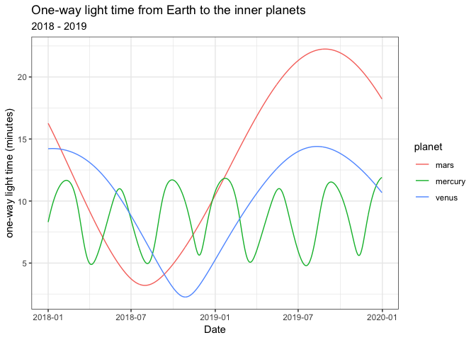

The closest planet to Earth
================
Neil Saunders
2019-01-16 22:15:06

Introduction
============

Which planet is closest to Earth, most of the time?

This [More Or Less](https://www.bbc.co.uk/sounds/play/m0001y9p) podcast claims that the answer is Mercury.

Datasets
========

We retrieve ephemeris data from the [JPL Horizons](https://ssd.jpl.nasa.gov/horizons.cgi) system, edit the text output manually and read it into R.

It looks like this. The `Date` range is January 1 2018 to December 31 2019, and `OWLT` = one-way light time.

<table style="width:42%;">
<colgroup>
<col width="13%" />
<col width="18%" />
<col width="9%" />
</colgroup>
<thead>
<tr class="header">
<th align="right">planet</th>
<th align="right">Date</th>
<th align="right">OWLT</th>
</tr>
</thead>
<tbody>
<tr class="odd">
<td align="right">mercury</td>
<td align="right">2018-01-01</td>
<td align="right">8.306</td>
</tr>
<tr class="even">
<td align="right">mercury</td>
<td align="right">2018-01-02</td>
<td align="right">8.475</td>
</tr>
<tr class="odd">
<td align="right">mercury</td>
<td align="right">2018-01-03</td>
<td align="right">8.641</td>
</tr>
<tr class="even">
<td align="right">mercury</td>
<td align="right">2018-01-04</td>
<td align="right">8.802</td>
</tr>
<tr class="odd">
<td align="right">mercury</td>
<td align="right">2018-01-05</td>
<td align="right">8.959</td>
</tr>
<tr class="even">
<td align="right">mercury</td>
<td align="right">2018-01-06</td>
<td align="right">9.111</td>
</tr>
<tr class="odd">
<td align="right">mercury</td>
<td align="right">2018-01-07</td>
<td align="right">9.259</td>
</tr>
<tr class="even">
<td align="right">mercury</td>
<td align="right">2018-01-08</td>
<td align="right">9.401</td>
</tr>
<tr class="odd">
<td align="right">mercury</td>
<td align="right">2018-01-09</td>
<td align="right">9.54</td>
</tr>
<tr class="even">
<td align="right">mercury</td>
<td align="right">2018-01-10</td>
<td align="right">9.673</td>
</tr>
</tbody>
</table>

There are 2190 observations (365 days x 2 x 3 planets).

Visualisation
=============

A very simple `ggplot2` of one-way light time versus date, with lines coloured by planet.

Conclusion
==========

At a given time any of Mercury, Venus or Mars may be closest to the Earth. The chart shows, for example, that Mars was closest around July 2018 and Venus in late 2018/early 2019.

Throughout 2019 both Mars and Venus are moving away from Earth, leaving Mercury as the closest planet for the majority of the year.
